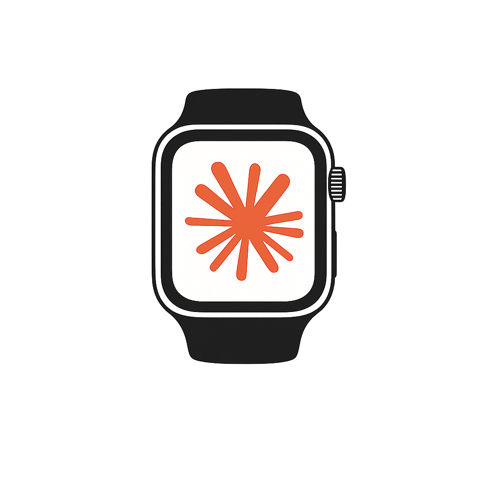

<p align="center">
  
</p>

<h1 align="center"><strong>Agent Watch</strong></h1>

<p align="center">
  Watch and control your <strong>Claude Code</strong>, <strong>Codex</strong>, and <strong>cmux</strong>
  sessions from your iPhone (and Apple Watch).<br/>
  See live terminal output, approve permission prompts, and send prompts — over your LAN or Tailscale.
</p>

https://github.com/user-attachments/assets/5f478c28-2086-4696-9d76-e43dda853201

---

## How it works (two halves)

```
   iPhone / Watch  ──HTTP+SSE──►  agent-watch bridge (Node)  ──hooks──►  Claude Code
   (SwiftUI app)   ◄────────────  on your Mac                 ──RPC───►  cmux mirror
                                                              ──log───►  Codex
```

- **Bridge (Mac):** a small Node server (`agent-watch`) that receives Claude Code
  hook events, mirrors live cmux workspaces, watches Codex, and serves the phone
  over HTTP + Server-Sent Events. Discovered on the LAN via Bonjour.
- **App (iPhone + Watch):** a SwiftUI app that pairs with the bridge, shows live
  sessions/terminal output, and answers permission prompts.

Everything runs **on your own machines** — no cloud, no account, no server to host.
The bridge binds the LAN; a pairing code + per-device token are the auth boundary.
**Run it over Tailscale or a trusted LAN — it is not built to face the open internet**
(see [`SECURITY.md`](SECURITY.md)).

> **cmux is optional.** With cmux installed you get the live workspace/terminal
> mirror; without it, the bridge still streams hook-based Claude/Codex sessions.

---

## Requirements

| Component | Minimum |
|-----------|---------|
| macOS | 13+ |
| Node.js | 18+ |
| Xcode | 16+ (to build the app) |
| iOS / watchOS | 17 / 10 |
| Claude Code | recent |
| cmux, Tailscale | optional |

---

## Install — the Mac bridge

```bash
git clone https://github.com/<you>/agent-watch && cd agent-watch/skill/bridge
npm ci                        # reproducible install (use `npm install` if no lockfile)
npm link                      # optional: puts `agent-watch` on your PATH
agent-watch setup             # or: node bin/agent-watch.js setup
```

`agent-watch setup` is **idempotent** (safe to re-run). It:

1. checks macOS + Node 18+, detects Claude/Codex/cmux/Tailscale,
2. writes `config.json` and generates secrets (`0600`, never rotated on re-run),
3. **backs up** `~/.claude/settings.json` and merges Agent Watch's hooks (scoped —
   it never touches another tool's hooks),
4. picks a runner — **in-cmux** when cmux is present (so the live mirror works), or
   a **LaunchAgent** when it isn't,
5. health-checks the bridge and prints your LAN/Tailscale address + pairing code.

> **Why two runners?** A `launchd` process cannot reach the cmux control socket
> (verified). So when cmux is present the bridge runs *inside* a cmux workspace;
> otherwise it runs as a LaunchAgent serving hook/phone/Codex sessions only.

Manage it with the CLI:

| Command | What it does |
|---|---|
| `agent-watch setup` | install / repair (idempotent) |
| `agent-watch doctor` | read-only diagnostics — **paste this into a GitHub issue** |
| `agent-watch status` | bridge state, LAN/Tailscale address, cmux, paired devices |
| `agent-watch pair` | show the pairing code · `--list` · `--revoke <id>` |
| `agent-watch logs` | tail the bridge log |
| `agent-watch restart` | restart the bridge |
| `agent-watch uninstall` | remove hooks + service (`--purge` also deletes data) |

---

## Install — the iPhone / Watch app (build it yourself)

There is **no App Store / TestFlight build** — Agent Watch is distributed as
source and you build it with your own free Apple ID. (TestFlight requires a paid
Apple Developer Program; a public binary may come later if the project enrolls.)

```bash
brew install xcodegen          # project.yml is the source of truth
cd ios/ClaudeWatch
xcodegen generate
open ClaudeWatch.xcodeproj
```

In Xcode:

1. **Set your own bundle id + Team.** In `project.yml`, change `bundleIdPrefix`
   (and the two `PRODUCT_BUNDLE_IDENTIFIER`s) from `com.example.agentwatch` to your
   own reverse-DNS id, then re-run `xcodegen generate`. The watch id must stay
   `<iphone-id>.watchkitapp`.
2. For **both** targets (ClaudeWatch + ClaudeWatchWatch): Signing →
   *Automatically manage signing* → select your **Personal Team**.
3. Connect your iPhone (+ paired Watch) → **Run** (⌘R).
4. On the device: Settings → General → VPN & Device Management → **trust** your
   developer certificate.

> **Free-team limits:** the app expires ~**7 days** after building (re-run from
> Xcode to refresh), **no push notifications** (local notifications only), max 3
> devices. SideStore/AltStore can auto-refresh the *iPhone* app wirelessly.

### Pair

1. Open the app → enter the **pairing code** from `agent-watch pair`.
2. Same Wi-Fi → the bridge is auto-discovered (Bonjour). Otherwise enter the
   Mac's IP/Tailscale address shown by `agent-watch status`.

Each device gets its **own token**; revoke any of them with
`agent-watch pair --revoke <id>` (see `agent-watch pair --list`).

> **Watch approvals (beta):** the Watch *shows* approvals but you answer them on
> the iPhone for now.

---

## Troubleshooting

Run **`agent-watch doctor`** first — it prints a PASS/WARN/FAIL report (no
secrets) that's ideal to paste into an issue.

- **iPhone "Connection failed":** `curl http://127.0.0.1:7860/health` (note:
  `/status` requires auth). Bridge + phone must share the LAN (or Tailscale).
- **No cmux workspaces:** cmux only mirrors when the bridge runs *inside* cmux
  (`agent-watch status` shows the runner). Without cmux you still get hook sessions.
- **Watch can't find the bridge:** same Wi-Fi; turn **off** Private Wi-Fi Address
  on the watch's network (Bonjour); or enter the IP manually.
- **Permission prompts don't appear:** confirm hooks in `~/.claude/settings.json`
  and that a device is paired (`agent-watch pair --list`).

---

## How it works

### Event flow (Mac → phone)
Claude Code runs a tool → a `PostToolUse`/`PreToolUse` hook POSTs to the bridge →
the bridge pushes an SSE event → the app renders it.

### Permission flow (Mac → phone → Mac)
Claude hits a permission prompt → the `PermissionRequest` hook **blocks** → the
bridge pushes a `permission-request` SSE event → the phone shows the options →
your choice is POSTed back → the bridge returns the decision to Claude.
(For codex exec-approvals, the bridge types the answer into the *pinned* cmux
terminal, guarded by a screen hash — it refuses if the screen changed.)

Hooks installed (loopback listener, secret-gated): `PostToolUse`, `PreToolUse`,
`PermissionRequest` (blocking, up to 10 min), `SessionStart`, `SessionEnd`,
`Stop`, error events.

---

## Security

The bridge listens on `0.0.0.0:<port>` (LAN-reachable). Auth is the pairing code
+ per-device token; the hook listener is loopback-only and secret-gated. Secrets
live outside the repo at `0600`. Prefer Tailscale over exposing the LAN port.
Full model + reporting in [`SECURITY.md`](SECURITY.md).

## License

MIT — see [`LICENSE`](LICENSE).

Agent Watch is a fork of [shobhit99/claude-watch](https://github.com/shobhit99/claude-watch)
(MIT); original-author copyright is preserved. See [`NOTICE.md`](NOTICE.md) for
attribution and trademark notes ("Claude" and its logo are Anthropic trademarks;
this is an independent community tool, not affiliated with Anthropic).
